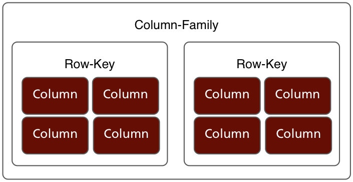
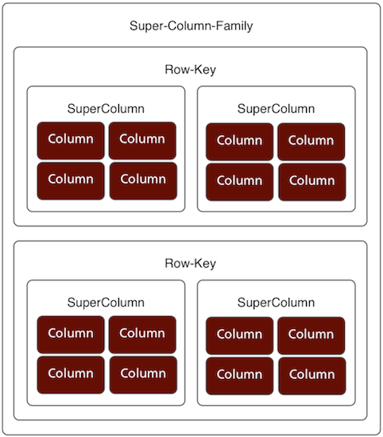

!SLIDE 

# Cassandra in 20 Slides

!SLIDE center

!SLIDE center

# [@roidrage](http://twitter.com/roidrage)

!SLIDE center

# ZOMG, IT'S NOSQL!!

!SLIDE bullets incremental

* Key-Value-Key-Value-Key-Value Store
* Cassandra is a distributed, multi-dimensional Hashtable

!SLIDE incremental bullets

# Data Model

* Row Keys
* Super Column Families
* Column Families
* Columns

!SLIDE small

# Key Spaces

    Users

!SLIDE small

# Row Keys

    Users["mathias"]

!SLIDE small

# Column Families
    
    Users["mathias"]
         [:UserDetails]

!SLIDE center

# Column Families

!SLIDE small

# Columns

    @@@ ruby
    "mathias" => {"name" => "Mathias Meyer"}

!SLIDE small

# Columns

    @@@ ruby
    Users["mathias"]
         [:UserDetails]
         ["name"] = "Mathias Meyer"

!SLIDE bullets incremental

# Data

* Is presorted
* It's a distributed, ordered hash, duh!

!SLIDE small

# Super Columns

    @@@ ruby
    Users["mathias"]
         [:FriendFeed]
         [TimeUUID.new]
         ["Liked a song"] = "sean"

!SLIDE center bullets incremental

# Super Column Families

!SLIDE bullets incremental

# Writes

* Timestamped
* Atomic per column and super column

!SLIDE bullets incremental

# Storage

* Writes are appended to a CommitLog
* Stored in a MergeTable
* Compacted into an SSTable

!SLIDE bullets incremental

# Distribution

* Dynamo-inspired
* Reads and writes quorum-based

!SLIDE bullets center

# Scaling up and down

* Just add more nodes

<object classid='clsid:d27cdb6e-ae6d-11cf-96b8-444553540000'
codebase='http://download.macromedia.com/pub/shockwave/cabs/flash/swflash.cab#version=9,0,115,0' width='560'
height='345'><param name='movie' value='http://screenr.com/Content/assets/screenr_1116090935.swf' /><param
name='flashvars' value='i=178614' /><param name='allowFullScreen' value='true' /><embed
src='http://screenr.com/Content/assets/screenr_1116090935.swf' flashvars='i=178614' allowFullScreen='true' width='560'
height='345' pluginspage='http://www.macromedia.com/go/getflashplayer'></embed></object>

!SLIDE smaller

# Ruby (Column Families)

    @@@ ruby
    require 'cassandra/0.7'
    client = Cassandra.new('SocialApp', '192.168.2.194:9160')
    client.get(:Users, 'mathias')
    # => {}

!SLIDE

# Ruby

    @@@ ruby
    client.insert(:Users, 'mathias', {
      'name' => 'Mathias Meyer',
      'company' => 'Basho'
    })

!SLIDE

# Ruby (Super Column Families)

    @@@ ruby
    client.insert(:FriendFeed, 'mathias', {
      UUID.new => {"sean" => "liked a song"}
    }, {
      :ttl => 1800
    })

!SLIDE

# Done
